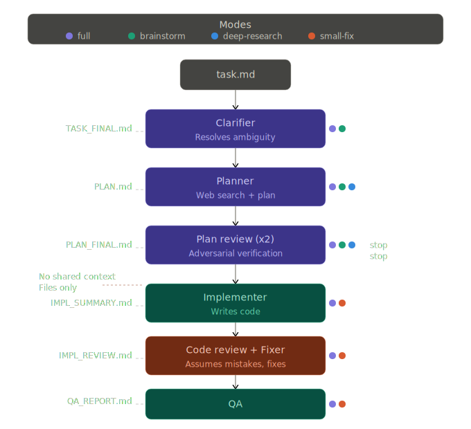

# MAW — Multi-Agent Workflow for Claude Code

**Prompt rules tell an LLM what to do. MAW adds a verification layer for when it doesn't listen.**

A sequential adversarial pipeline where each agent reviews the previous agent's work against actual code, not descriptions. Each agent operates under the assumption the previous one was weaker and made mistakes.

Prompt guidelines like Karpathy's (30k+ stars) are useful conventions — MAW is complementary: it catches what slips through despite the rules.

**Empirical result (single user, two projects, ~30k LOC):** zero bugs shipped over two weeks. Anecdotal, not a benchmark — your mileage will vary depending on codebase and task complexity.

## The problem

You can paste the best coding guidelines into your system prompt. The LLM will read them, agree they're important, and then drift from them under complex context. An agent that writes code and reviews its own output has the same blind spots in both passes.

Compare:

| Approach | How it works | Failure mode |
|---|---|---|
| Prompt rules (Karpathy-style) | Tell the agent "be careful" | Agent drifts from rules under complex context |
| Self-review | Agent checks its own work | Same blind spots that caused the error review the error |
| **MAW** | Independent agents verify against code | Reviewer has no shared context with implementer — different blind spots |

## Architecture



Key design decisions:
- **No shared context** — agents communicate only through files (task.md, PLAN.md, diffs). No chat history carries over. This is a common pattern in adversarial pipelines, but MAW enforces it across all 7 stages including planning.
- **Adversarial by default** — each agent's prompt includes the assumption that the previous agent was unreliable. Not hostile, but skeptical.
- **All state in git** — artifacts live in the task folder on a feature branch. Everything is inspectable and recoverable.

## Modes

Not every task needs 7 agents. MAW has four modes that control which part of the pipeline runs:

| Mode | Pipeline | When to use | ~Tokens |
|---|---|---|---|
| `full` | Clarifier → Planner → Plan Review x2 → Implementer → Code Review → Fixer → QA | Features, migrations, auth/payments | 280–560k |
| `small-fix` | Implementer → Code Review → Fixer → QA | Bug fixes, small changes with clear scope | 120–200k |
| `brainstorm` | Clarifier → Planner → Plan Review x2 | Explore approaches before committing to implementation | 100–180k |
| `deep-research` | Planner (web search) → Plan Review x2 | Research best practices, compare solutions, audit approaches | 80–150k |

When you create a task, MAW analyzes the description and suggests a mode:

```
> /add-task "fix 404 on the profile page"

This looks like a focused bug fix with clear scope.
Suggested mode: small-fix (Implementer → Code Review → Fixer → QA)

[full] [small-fix] [brainstorm] [deep-research]
```

You confirm or override. The mode is saved in `task.md`:

```markdown
# TASK-001: Fix 404 on the profile page

Type: bugfix
Mode: small-fix
Priority: high
Branch: bugfix/fix-profile-404
```

`Type` is the semantic category (feature, bugfix, refactor, chore). `Mode` is which agents run. You can set mode explicitly with `/add-task --mode deep-research` or change it in task.md before running `/maw`.

## Install

```bash
curl -fsSL https://raw.githubusercontent.com/pockerhead/maw/main/install.sh | sh
```

Add to your project's `CLAUDE.md`:

```markdown
## Skills
@.claude/skills/maw/SKILL.md
@.claude/skills/tasks/SKILL.md
```

## Usage

Create tasks:
```
/add-task                                          # interactive intake
/add-task "description here"                       # one-shot, mode is suggested
/add-task --mode small-fix "fix 404 on profile"    # explicit mode, skips suggestion
/add-task --mode deep-research "rate limiting options"
```

Flags:
- `--mode <full|small-fix|brainstorm|deep-research>` — set the MAW mode directly and skip the suggestion step. Without this flag, the skill analyzes the description and proposes a mode you can confirm or override.

Run the pipeline:
```
/maw                 # pick the highest-priority pending task
/maw 3               # run TASK-003 specifically (jump the queue)
/maw TASK-003        # same, explicit form
/maw --worktree      # force worktree mode for this run
/maw --no-worktree   # force branch-only mode for this run
/maw 3 --worktree    # combine: run TASK-003 in a worktree
```

Flags:
- `--worktree` — isolate the task in a git worktree (overrides saved setting for this run)
- `--no-worktree` — work on a feature branch directly, no worktree (overrides saved setting for this run)

Positional arg (task number or `TASK-NNN`): skip priority selection and run a specific task. Useful for urgent work that needs to jump the queue, or retrying a blocked task. The task must exist in `pending/` or `blocked/`.

## What gets produced

Every run leaves a full audit trail in the task folder. Artifacts depend on mode:

**full mode:**
```
maw/tasks/done/TASK-001/
├── task.md           ← original task
├── TASK_FINAL.md     ← clarified requirements
├── PLAN.md           ← initial plan
├── PLAN_V2.md        ← reviewed plan
├── PLAN_FINAL.md     ← final plan after two review passes
├── IMPL_SUMMARY.md   ← what was implemented
├── IMPL_REVIEW.md    ← code review findings
├── FIX_SUMMARY.md    ← what was fixed after review
└── QA_REPORT.md      ← test results
```

**small-fix:** task.md + IMPL_SUMMARY.md + IMPL_REVIEW.md + FIX_SUMMARY.md + QA_REPORT.md

**brainstorm:** task.md + TASK_FINAL.md + PLAN.md + PLAN_V2.md + PLAN_FINAL.md

**deep-research:** task.md + PLAN.md (research report) + PLAN_V2.md + PLAN_FINAL.md

## How it compares

The adversarial multi-agent space is growing. Several tools take different slices of the problem:

| | MAW | Claude Forge | adversarial-dev | Forge AI | adversarial-review (ng) |
|---|---|---|---|---|---|
| Approach | Sequential adversarial | GAN-style loops | GAN 3-agent harness | Competing architects + judge | Dual-agent consensus |
| Scope | Task → QA (full cycle) | Feature + audit + docs | Planning → building → eval | Planning + execution | Code review only |
| Modes | 4 (full, small-fix, brainstorm, deep-research) | brainstorm + audit | — | --fast flag | Cost-gating by diff score |
| Task management | Built-in (pending/done/blocked) | No | No | No | No |
| Provider | Claude Code | Claude Code | Claude SDK + Codex SDK | Claude/Codex/Cursor/API | Claude Code |
| Install | One curl | cp -r | git clone + pip | pip install | /plugin marketplace |

MAW's specific niche: full lifecycle with built-in task tracking and mode-based cost control. If you need only code review, ng/adversarial-review is more focused. If you need provider-agnostic planning, Forge AI is better suited.

## Cost and when to use

MAW trades tokens for reliability. Token consumption depends on mode:

| Mode | Tokens | Cost (Sonnet) |
|---|---|---|
| full | 280–560k | $1–4 |
| small-fix | 120–200k | $0.5–1.5 |
| brainstorm | 100–180k | $0.4–1.2 |
| deep-research | 80–150k | $0.3–1 |

Each agent consumes 40–70k tokens on a medium-sized codebase. Implementer and Code Review can exceed 100k on complex tasks. At Opus pricing, multiply accordingly.

The tradeoff: if the cost of shipping a bug exceeds the cost of running the pipeline, use MAW. Modes let you pick the right level of rigor per task instead of paying for the full pipeline every time.

## Settings

First run asks about branching preference. Saved to `maw/settings.json`:

| Value | Behavior |
|---|---|
| `always` | Git worktree per task (default) |
| `never` | Feature branch only |
| `ask` | Prompt each time |

## License

MIT
