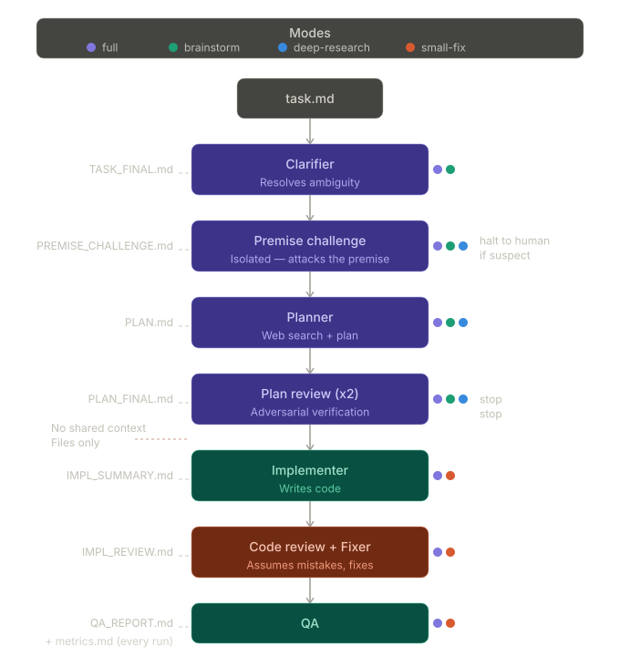

# MAW — Multi-Agent Workflow for Claude Code & Codex CLI

**Prompt rules tell an LLM what to do. MAW adds a verification layer for when it doesn't listen.**

A sequential adversarial pipeline where each agent reviews the previous agent's work against actual code, not descriptions. Each agent operates under the assumption the previous one was weaker and made mistakes.

Prompt guidelines like Karpathy's (30k+ stars) are useful conventions — MAW is complementary: it catches what slips through despite the rules.

**Empirical result (single user, two projects, ~30k LOC):** zero bugs shipped over two weeks. Anecdotal, not a benchmark — your mileage will vary depending on codebase and task complexity.

## The problem

You can paste the best coding guidelines into your system prompt. The LLM will read them, agree they're important, and then drift from them under complex context. An agent that writes code and reviews its own output has the same blind spots in both passes.

Compare:

| Approach | How it works | Failure mode |
|---|---|---|
| Prompt rules (Karpathy-style) | Tell the agent "be careful" | Agent drifts from rules under complex context |
| Self-review | Agent checks its own work | Same blind spots that caused the error review the error |
| **MAW** | Independent agents verify against code | Reviewer has no shared context with implementer — different blind spots |

## Architecture



*(The diagram shows the stage flow; the provider dispatch layer — which harness runs each stage — is described under Settings below.)*

Key design decisions:
- **No shared context** — agents communicate only through files (task.md, PLAN.md, diffs). No chat history carries over. This is a common pattern in adversarial pipelines, but MAW enforces it across every stage including planning.
- **Adversarial by default** — each agent's prompt includes the assumption that the previous agent was unreliable. Not hostile, but skeptical.
- **Premise challenge** — before planning, an isolated agent fed only the task and the real system (never the orchestrator's framing, the plan, or any summary) tests whether the *premise itself* is wrong, and halts to the human if it is. Every other stage verifies the solution within the premise and inherits its lineage; this is the one structural check that attacks the frame. It reduces — does not eliminate — the "pipeline faithfully executes a wrong premise" failure; the human remains the last line.
- **All state in git** — artifacts live in the task folder on a feature branch. Everything is inspectable and recoverable.

## Modes

Not every task needs the whole pipeline. MAW has four modes that control which part runs:

| Mode | Pipeline | When to use | ~Tokens |
|---|---|---|---|
| `full` | Clarifier → Premise Challenge → Planner → Plan Review x2 → Implementer → Code Review → Fixer → QA | Features, migrations, auth/payments | 280–560k |
| `small-fix` | Implementer → Code Review → Fixer → QA | Bug fixes, small changes with clear scope | 120–200k |
| `brainstorm` | Clarifier → Premise Challenge → Planner → Plan Review x2 | Explore approaches before committing to implementation | 100–180k |
| `deep-research` | Premise Challenge → Planner (web search) → Plan Review x2 | Research best practices, compare solutions, audit approaches | 80–150k |

When you create a task, MAW analyzes the description and suggests a mode:

```
> /maw-tasks "fix 404 on the profile page"

This looks like a focused bug fix with clear scope.
Suggested mode: small-fix (Implementer → Code Review → Fixer → QA)

[full] [small-fix] [brainstorm] [deep-research]
```

You confirm or override. The mode is saved in `task.md`:

```markdown
# TASK-001: Fix 404 on the profile page

Type: bugfix
Mode: small-fix
Priority: high
Branch: bugfix/fix-profile-404
```

`Type` is the semantic category (feature, bugfix, refactor, chore). `Mode` is which agents run. You can set mode explicitly with `/maw-tasks --mode deep-research` or change it in task.md before running `/maw-execute-task`.

## Install

```bash
curl -fsSL https://raw.githubusercontent.com/pockerhead/maw/main/install.sh | sh
```

With no flags the installer detects which harnesses are present (`claude`, `codex`) and installs a surface for each. Explicit targets: `sh install.sh --claude`, `--codex`, or `--all`; add `--with-reason` for the experimental deliberation surface and `--with-hooks` for its gate. On Windows run it through Git Bash (`sh install.sh`); a native `install.ps1` twin is planned but not shipped yet.

- **Claude Code surface**: `.claude/skills/{maw-execute-task,maw-tasks,maw-context}/` (+ raw agent bodies) and 45 named subagents in `.claude/agents/`; `--with-reason` adds the `maw-reason` skill, 6 role bodies, and 30 more subagents.
- **Codex CLI surface**: `.agents/skills/{maw-execute-task,maw-tasks,maw-context}/` (+ raw agent bodies) — repository-scoped skills, committable, so teammates on the other harness get a working install from git without re-running the installer. `maw-reason` is Claude-only in v1.

For Claude Code, add to your project's `CLAUDE.md`:

```markdown
## Skills
@.claude/skills/maw-execute-task/SKILL.md
@.claude/skills/maw-tasks/SKILL.md
@.claude/skills/maw-context/SKILL.md
```

**Restart the harness after installing (or reinstalling).** Claude Code discovers the named subagents in `.claude/agents/` at session start; Codex discovers repository skills at startup — neither picks them up mid-session. Start a fresh session before invoking `/maw-execute-task`, or spawns will fail to resolve.

**Invocation per harness:** in Claude Code, type the slash commands (`/maw-tasks`, `/maw-execute-task`). In Codex there are no custom slash commands — ask in words ("create a task with the maw-tasks skill", "run maw-execute-task for task 3") and the repository skill is picked up. **Codex hosting on Windows** additionally requires launching the orchestrator with the sandbox disabled (nested provider CLIs cannot reach your credentials from inside the codex sandbox, and `.git` is write-protected there); — see the Hosting section of the orchestrator skill. Note that a Codex host always loads your own `~/.codex/AGENTS.md` (an interactive session has no way to suppress it) — that is accepted: the orchestrator treats its skill contract as outranking ambient instructions, and pipeline agents never inherit them.

## Usage

Create tasks:
```
/maw-tasks                                          # interactive intake
/maw-tasks "description here"                       # one-shot, mode is suggested
/maw-tasks --mode small-fix "fix 404 on profile"    # explicit mode, skips suggestion
/maw-tasks --mode deep-research "rate limiting options"
```

Flags:
- `--mode <full|small-fix|brainstorm|deep-research>` — set the MAW mode directly and skip the suggestion step. Without this flag, the skill analyzes the description and proposes a mode you can confirm or override.

Run the pipeline:
```
/maw-execute-task                 # pick the highest-priority pending task
/maw-execute-task 3               # run TASK-003 specifically (jump the queue)
/maw-execute-task TASK-003        # same, explicit form
/maw-execute-task --worktree      # force worktree mode for this run
/maw-execute-task --no-worktree   # force branch-only mode for this run
/maw-execute-task 3 --worktree    # combine: run TASK-003 in a worktree
```

Flags:
- `--worktree` — isolate the task in a git worktree (overrides saved setting for this run)
- `--no-worktree` — work on a feature branch directly, no worktree (overrides saved setting for this run)

Positional arg (task number or `TASK-NNN`): skip priority selection and run a specific task. Useful for urgent work that needs to jump the queue, or retrying a blocked task. The task must exist in `pending/` or `blocked/`.

## What gets produced

Every run leaves a full audit trail in the task folder. Artifacts depend on mode:

**full mode:**
```
maw/tasks/done/TASK-001/
├── task.md           ← original task
├── TASK_FINAL.md     ← clarified requirements
├── PREMISE_CHALLENGE.md ← isolated premise audit (holds / suspect, primary-source cited)
├── PLAN.md           ← initial plan
├── PLAN_V2.md        ← reviewed plan
├── PLAN_FINAL.md     ← final plan after two review passes
├── IMPL_SUMMARY.md   ← what was implemented
├── IMPL_REVIEW.md    ← code review findings
├── FIX_SUMMARY.md    ← what was fixed after review
├── QA_REPORT.md      ← test results
└── metrics.md        ← per-agent tokens / tool uses / duration + task total
```

`metrics.md` is written by the orchestrator (not by agents — they never see it). One row per agent spawn, including retries and re-spawns, with provider/model/effort columns; usage comes from the Task result's usage trailer (native spawns) or the CLI's JSON output (external spawns). Wrap-up appends per-provider `SUBTOTAL` rows plus a `TOTAL` row (spawn count, tool uses, duration — token counts are never summed across providers). Present in every mode.

**small-fix:** task.md + IMPL_SUMMARY.md + IMPL_REVIEW.md + FIX_SUMMARY.md + QA_REPORT.md + metrics.md

**brainstorm:** task.md + TASK_FINAL.md + PREMISE_CHALLENGE.md + PLAN.md + PLAN_V2.md + PLAN_FINAL.md + metrics.md

**deep-research:** task.md + TASK_FINAL.md (orchestrator-written copy of task.md) + PREMISE_CHALLENGE.md + PLAN.md (research report) + PLAN_V2.md + PLAN_FINAL.md + metrics.md

Plus `PCTX_PROPOSALS.md` in any task where an agent proposed a project-context change (see below).

## Adversarial deliberation — `/maw-reason` (experimental, Claude Code only)

A third surface, beside task intake and task execution. It answers a **question** instead of running a work item: no task folder, no branch, no worktree, no status moves. Opt-in at install (`--with-reason`) because **no chain has yet been run end to end** — see the `maw-reason` rows in `docs/ACCEPTANCE.md` for what is unverified.

```
/maw-reason "should we shard this table or partition it?"
/maw-reason --deep "..."             # raise compressor/attacker/synthesizer effort
/maw-reason --keep "..."             # persist the trace for audit
/maw-reason --high-assurance "..."   # two generators on distinct profiles (+1 spawn)
```

Five spawns: **premise check → generator → compressor → attacker → synthesizer**. The compressor is what makes it a dialectic rather than an ensemble — a non-author decides which claims are load-bearing and proposes the `attack_vector`, so the attacker cannot pick its own exemption surface. The vector is a floor: an off-vector scan is mandatory.

Output is a synthesis with an explicit **disagreement ledger** (unresolved conflicts stay unresolved), stated confidence tied to what survived attack, and concrete what-would-change-my-mind triggers.

**The calling session does not author the chain's prompts.** It captures the question verbatim, then spawns a coordinator that cannot see the calling conversation and builds every downstream prompt itself. Your own tentative answer goes into a `CALLER_POSITION.md` that reaches the **attacker only** — not to protect it, but so it gets attacked like everything else.

That invariant is narrower than it sounds, and the skill says so: the caller still writes the fact allowlist and the constraints, and the coordinator routing `CALLER_POSITION.md` correctly is an instruction, not an enforcement. What the coordinator does record is the file list and prompt hash it fed each role, so a deviation is visible after the fact. Auditable exclusion, not a mechanical seal — a real seal needs a non-LLM dispatcher.

**Two effort profiles.** `fast` (default) runs everything at `low` except a `medium` attacker; `--deep` raises compressor, attacker, and synthesizer. The split exists because "low is mechanical" is false for exactly two roles: the compressor decides what gets attacked and the synthesizer decides what the attack established. A `fast` run can miss a problem by never aiming at it, and no attacker effort recovers a target that was never selected — so for the high-stakes questions this skill is meant for, `--deep` is the honest default. Roughly 200–350k tokens either way (240–420k with `--high-assurance`); the synthesis prints which profile ran so a quiet attacker can be weighed correctly.

### The gate hook

A simulated chain and a real one look identical in their output text — that is what makes this surface different from the task pipeline, where a missing implementation is visible in the diff. `install.sh --claude --with-hooks` adds a `Stop` hook that blocks the turn unless the run's own manifest is satisfied: every expected artifact present and newer than the question, and a ledger with the expected number of distinct successful role spawns. It reads `RUN.json`, so a five-spawn run cannot pass as a claimed `--high-assurance` one.

The hook raises the cost of faking a chain from "write some prose" to "fabricate a consistent evidence set on purpose". A model that can write files can still forge all of it. It is not a security boundary, and describing it as one would be the same overclaim the chain exists to catch — what it does is turn an accidental shortcut into a deliberate lie.

## Project context overlay

The base pipeline is 100% generic — it contains no knowledge of your project. Project-specific knowledge lives in `maw/project-context/`, authored with `/maw-context`.

```
/maw-context            # scaffold, or add an invariant / domain / lesson / tool
/maw-context --review   # fold pending agent proposals into the overlay
```

If `maw/project-context/` does not exist, the pipeline behaves byte-for-byte as with no overlay — this is the default and requires nothing. If it exists, three tiers are injected, each gated on a different axis:

- `README.md` — **constant**, into every agent every stage. Only what is true regardless of subsystem or stage: a short orientation, universal invariants, and a **domain catalog** (observable `trigger → domains/<name>.md` lines plus a hard rule to self-load a module on a matching trigger). Bounded by domain count, not free — kept disciplined.
- `domains/<name>.md` — **domain-gated**, normative. Injected into every running stage (planner and reviewers included — planning correctness needs it) when the task is in that domain. It gets there two ways: pre-injected because `task.md` declared `Domains:` (a recorded decision `/maw-tasks` proposes and the user confirms), or self-loaded when an agent hits an observable catalog trigger a task did not predict (the recall safety net). Subsystem invariants, risk lessons, and pointers to bulky docs live here.
- `agents/<stem>.md` — **stage-gated**, into one agent only. Build/test/runtime-QA tooling and stage skills — clarifier and planners do not carry tooling they never use.

A subagent inherits nothing — not `CLAUDE.md`, not `@`-imports, not notebooks (a verified Claude Code invariant the pipeline is built around), so everything needed must be injected or read from disk by the agent itself. Project context is normative as **law to satisfy, not a claim to audit** — review agents verify the code satisfies it; whether the law itself is right is human-gated via `/maw-context --review`. Agents never edit the overlay: they append dated entries to that task's `PCTX_PROPOSALS.md`, folded in deliberately.

This is reduced, human-authored machinery — a hand-written catalog and human-declared `Domains:`, no resolution engine, no token-budget gate, no includes. The base change is the orchestrator plus the `maw-context`/`maw-tasks` skills; the overlay seam never modifies the agent prompts.

## Roadmap graph

`maw/ROADMAP.md` is an auto-maintained dependency view of the pending task board, derived from the `## Dependencies` section of each `task.md` (`task.md` is the source of truth — the graph is never authoritative). `/maw-tasks` regenerates it on every task create/edit; `/maw-execute-task` reconciles it against the task files before starting and drops the started task out of the pending graph. It is a short tree of hard blockers plus a list of soft orderings and unblocks — structure only, no narrative. Optional: absence is not an error, and projects that never declare dependencies never get one.

## How it compares

The adversarial multi-agent space is growing. Several tools take different slices of the problem:

| | MAW | Claude Forge | adversarial-dev | Forge AI | adversarial-review (ng) |
|---|---|---|---|---|---|
| Approach | Sequential adversarial | GAN-style loops | GAN 3-agent harness | Competing architects + judge | Dual-agent consensus |
| Scope | Task → QA (full cycle) | Feature + audit + docs | Planning → building → eval | Planning + execution | Code review only |
| Modes | 4 (full, small-fix, brainstorm, deep-research) | brainstorm + audit | — | --fast flag | Cost-gating by diff score |
| Task management | Built-in (pending/done/blocked) | No | No | No | No |
| Provider | Claude Code + Codex CLI (per-stage) | Claude Code | Claude SDK + Codex SDK | Claude/Codex/Cursor/API | Claude Code |
| Install | One curl | cp -r | git clone + pip | pip install | /plugin marketplace |

MAW's specific niche: full lifecycle with built-in task tracking, mode-based cost control, and per-stage provider assignment (e.g. cross-vendor code review). If you need only code review, ng/adversarial-review is more focused.

## Cost and when to use

MAW trades tokens for reliability. Token consumption depends on mode:

| Mode | Tokens | Cost (Sonnet) |
|---|---|---|
| full | 280–560k | $1–4 |
| small-fix | 120–200k | $0.5–1.5 |
| brainstorm | 100–180k | $0.4–1.2 |
| deep-research | 80–150k | $0.3–1 |

Each agent consumes 40–70k tokens on a medium-sized codebase. Implementer and Code Review can exceed 100k on complex tasks. At Opus pricing, multiply accordingly.

Codex-provider stages are billed per your Codex auth mode (ChatGPT plan quota or API-key tokens) — the table above prices Claude tokens only; `metrics.md` keeps per-provider subtotals and never sums tokens across providers.

The tradeoff: if the cost of shipping a bug exceeds the cost of running the pipeline, use MAW. Modes let you pick the right level of rigor per task instead of paying for the full pipeline every time.

## Settings

First run asks two things, both saved to `maw/settings.json`.

**Branching** (`worktree_mode`):

| Value | Behavior |
|---|---|
| `always` | Git worktree per task (default) |
| `never` | Feature branch only |
| `ask` | Prompt each time |

**Agent provider, model, and effort.** Every agent resolves an atomic profile `(provider, model, effort)`. Zero-config default: every agent runs on the host harness's provider with that provider's defaults (`claude: sonnet/medium`, `codex: gpt-5.6-sol/medium`). On the Claude-native path, effort is a **real Claude Code effort level** baked into each generated subagent variant (`maw-<stem>-<effort>` in `.claude/agents/`) and model is the Task tool's `model` parameter; on the external path (cross-provider stages, or a Codex host) both are CLI flags on a one-shot headless spawn.

```json
{
  "worktree_mode": "always",
  "default_provider": "host",
  "providers": {
    "claude": { "default_model": "sonnet",      "default_effort": "medium" },
    "codex":  { "default_model": "gpt-5.6-sol", "default_effort": "medium" }
  },
  "agents": {
    "code-reviewer": { "provider": "codex", "model": "gpt-5.6-sol", "effort": "xhigh" },
    "planner":       { "model": "opus" }
  }
}
```

(Legacy v1 settings — `agent_model`/`agent_effort` + override maps — are migrated automatically on first run, preserving behavior. Other keys: `spawn_timeout_min` — wall-clock cap per external spawn, default 30; `allow_unverified_profile` — pass unknown models through with a warning instead of rejecting, default false; `auto_invoke_guard` — per-skill map gating model-chosen invocation, e.g. `{ "maw-execute-task": true }`, values `true` (confirm first, default when absent) | `false` (unattended) | `"never"` (decline).)

Agent names: `clarifier`, `premise-challenge`, `planner`, `plan-reviewer-1`, `plan-reviewer-2`, `implementer`, `code-reviewer`, `fixer`, `qa`. Models are provider-scoped — claude: `sonnet`, `opus`, `haiku`, `fable`; codex: `gpt-5.6-sol`, `gpt-5.6-terra`, `gpt-5.6-luna`, `gpt-5.5`. Effort: `low`, `medium`, `high`, `xhigh`, `max` (plus `ultra` on codex 5.6-family). Effort validity depends on the model (claude `haiku` caps at `high`; codex `gpt-5.5` caps at `xhigh`) — the orchestrator clamps against its versioned capability catalog and **stops with a report on an invalid pair; nothing silently downgrades**. Edit `maw/settings.json` directly to change the defaults later.

**Cross-provider agents (experimental).** Any pipeline stage can run on a different harness than the orchestrator — e.g. code review on Codex while everything else runs on Claude. A cross-vendor reviewer brings a genuinely different prior, so its blind spots correlate less with the implementer's. External spawns are one-shot headless CLI runs with ambient-context isolation (the child loads neither the project's AGENTS.md/CLAUDE.md nor your personal one — for codex that takes a private per-spawn `CODEX_HOME` holding only a copy of `auth.json`, since no CLI flag suppresses `~/.codex/AGENTS.md`; suppression is canary-tested per machine as part of preflight), a fresh context, and per-spawn usage accounting where the CLI provides it (codex: yes; claude external: pending fixture — recorded as `n/a` until then). Requirements: the other CLI installed and logged in; the orchestrator preflights binary, auth, and a transport probe before a task leaves `pending/`. Token subtotals in `metrics.md` are per-provider — cross-provider counts are never summed (different tokenizers). **Status:** the cross-provider and Codex-host paths are experimental until the acceptance checklist in `docs/ACCEPTANCE.md` is green. The Claude-native path is unchanged in mechanics, with two newly specified rules pending an E2E run each (deep-research spec fallback; local-only+worktree copy-back) — see the same checklist.

**Per-task override.** A task can override all three via optional `task.md` header lines, which beat `settings.json` for that task only:

```markdown
Providers: code-reviewer=codex
Models: default=opus, code-reviewer=gpt-5.6-sol
Effort: code-reviewer=xhigh, qa=high
```

Each line is comma-separated tokens: `default=<v>` sets the task-wide value, `<agent>=<v>` sets one agent. An explicit per-agent value that contradicts the resolved provider (e.g. `Providers: code-reviewer=codex` + `Models: code-reviewer=opus`) is a hard stop, not a silent substitution; inherited task-wide values simply don't apply to agents on another provider. When you create a task with `/maw-tasks`, MAW may itself propose reinforcing specific agents (stronger model / higher effort / cross-provider review) for risky tasks — auth, payments, migrations, concurrency — which you confirm, edit, or decline. Resolution precedence: task.md per-agent → task.md task-wide → settings.json `agents` → settings.json defaults → built-in.

## License

MIT
